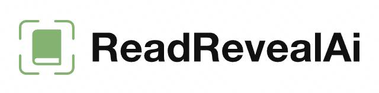

# ReadReveal AI

  

## 📖 About

ReadReveal AI is a mobile app that uses Google's Gemini API to analyze and explain text in images. Simply take a photo of any text (book, document, sign) and get instant explanations of complex terms.

## ✨ Features

- 📷 **Capture Text**: Snap a photo of any printed text
- 🧠 **AI-Powered Analysis**: Uses Google's Gemini API to understand context
- 💾 **Save History**: Review your past scans anytime
- 🔒 **Privacy-Focused**: Your API key is stored securely locally on your device

## 🔧 Getting Started

1. Get a Gemini API key from [Google AI Studio](https://ai.google.dev/)
2. Add your API key in the Settings page
3. Start scanning text!

## 🛠️ Built With

- [Flutter](https://flutter.dev/) - UI framework
- [Gemini API](https://ai.google.dev/) - AI text analysis
- [Hive](https://docs.hivedb.dev/) - Local storage
- [Provider](https://pub.dev/packages/provider) - State management
- [Camera](https://pub.dev/packages/camera) - Image capture

## 📄 License

This project is licensed under the MIT License - see the LICENSE file for details.

## 💭 Developer's Comment - Bring Your Own API key

> I'm building ReadReveal AI as part of a new wave of serverless applications that put users in control. By using your own API keys directly with LLMs like Google's Gemini, we can:
> 
> - **Eliminate expensive backend costs** that would otherwise be passed to users as subscription fees
> - **Increase privacy** by keeping your data flowing directly between your device and the AI provider
> - **Provide powerful AI tools as free, open-source software** accessible to everyone
> - **Build sustainable products** that don't require ongoing server maintenance

